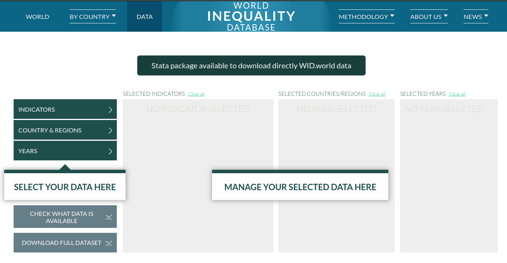

# World Inequality Database – Data Production Codebase

This is the official code repository for generating the datasets of the [World Inequality Database (WID.world)](https://wid.world/), an open-access platform for global income and wealth inequality statistics. This repository contains the full codebase used to construct the WID datasets. These datasets underpin the World Inequality Reports and provide detailed, long-run inequality statistics across the globe.

## Documentation

- [Methodology Overview](https://wid.world/methodology/)
- [Distributional National Accounts Guidelines](https://wid.world/document/distributional-national-accounts-guidelines-2020-concepts-and-methods-used-in-the-world-inequality-database/)
- [Research Tools](https://wid.world/research-tools/)
- [Codes Dictionary](https://wid.world/codes-dictionary/)
