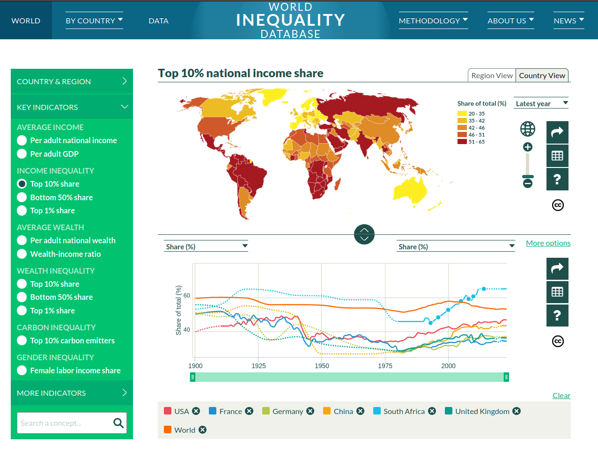

# World Inequality Database – Data Production Codebase

Welcome to the official code repository for generating the datasets of the [World Inequality Database (WID.world)](https://wid.world/), an open-access platform for global income and wealth inequality statistics.

## About the Project

This repository contains the full codebase used to construct the WID datasets. These datasets underpin the World Inequality Reports and provide detailed, long-run inequality statistics across the globe.

## Documentation

- [Methodology Overview](https://wid.world/methodology/)
- [Distributional National Accounts Guidelines](h[ttps://wid.world/methodology/](https://wid.world/document/distributional-national-accounts-guidelines-2020-concepts-and-methods-used-in-the-world-inequality-database/))
- [Research Tools](https://wid.world/research-tools/)
- [Codes Dictionary](https://wid.world/codes-dictionary/)

## Contact

For questions or collaborations:

- Email: [info@wid.world](mailto:info@wid.world)
- Website: [https://wid.world](https://wid.world)

